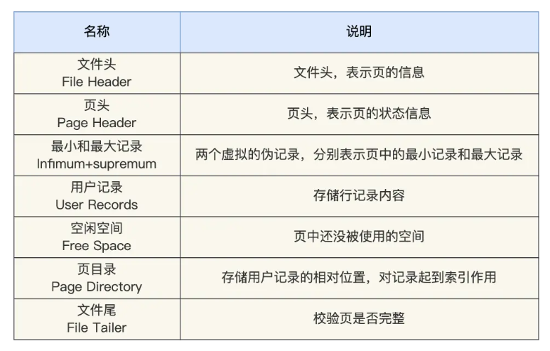

# MYSQL 如何保存一行数据

[参考小林的八股](https://xiaolincoding.com/mysql/base/row_format.html#记录的额外信息)

## MySQL 的数据保存在哪里？
从存储介质的角度，数据保存在硬盘上————是持久化存储。
从文件系统的角度，MySQL的存储数据保存在哪一个目录下？
innodb存储引擎下，默认是保存在 `/var/lib/mysql` 下的。

可以通过mysql命令行客户端，输入命令查看数据保存的目录。

```sql
mysql> show variables like 'datadir';
+---------------+-----------------+
| Variable_name | Value           |
+---------------+-----------------+
| datadir       | /var/lib/mysql/ |
+---------------+-----------------+
1 row in set (0.00 sec)
```
每当我们创建一个database、就会在 `/var/lib/mysql`下面创建一个目录。
例如现在创建一个库database。
```sql
CREATE DATABASE testdb CHARACTER SET utf8mb4 COLLATE utf8mb4_unicode_ci;
```
再去文件系统下面就可以看到这同名目录。
第二行最后一个就是刚才创建的数据库的目录。
```shell
bash-5.1# ls /var/lib/mysql
'#ib_16384_0.dblwr'   auto.cnf        ca-key.pem        ib_buffer_pool   mysql.ibd               private_key.pem   sys
'#ib_16384_1.dblwr'   binlog.000001   ca.pem            ibdata1          mysql.sock              public_key.pem    testdb
'#innodb_redo'        binlog.000002   client-cert.pem   ibtmp1           mysql_upgrade_history   server-cert.pem   undo_001
'#innodb_temp'        binlog.index    client-key.pem    mysql            performance_schema      server-key.pem    undo_002
```
再来给这个库里面建一个表。
```sql
-- 创建 user 表
CREATE TABLE user (
    id INT AUTO_INCREMENT PRIMARY KEY COMMENT '用户唯一标识',
    username VARCHAR(50) NOT NULL UNIQUE COMMENT '用户名，唯一',
    password VARCHAR(100) NOT NULL COMMENT '用户密码'
) ENGINE=InnoDB DEFAULT CHARSET=utf8mb4 COMMENT='用户表';

Query OK, 0 rows affected (0.14 sec)

mysql> show tables;
+------------------+
| Tables_in_testdb |
+------------------+
| user             |
+------------------+
1 row in set (0.01 sec)
``` 
再去查看/var/lib/mysql/testdb 就能看到 user.idb文件。
这个就是用来存储user表的数据的。MySQL 中每一张表的数据都存放在一个独立的 .ibd 文件。

我们增删改查表，都是在对这个.idb里面的数据打交道。

## .idb的内部结构
一张表对应一个idb文件，这个文件由段（segment）、区（extent）、页（page）、行（row）组成。


### 行
行就是数据行，数据库表中的记录都是按行（row）进行存放的。

行有好几种组织格式，可以使用下面的语句查看行的格式。5.7之后默认是dynamic了。
```sql
mysql> show variables like "innodb_default_row_format";
+---------------------------+---------+
| Variable_name             | Value   |
+---------------------------+---------+
| innodb_default_row_format | dynamic |
+---------------------------+---------+
1 row in set (0.05 sec)

mysql> 
```
行的数据，大致分为2个部分：真实数据，记录的额外信息。

记录的额外信息是指：记录头信息，边长字段长度列表，NULL值列表。
#### 变长字段列表
varchar(n) 这种字段的长度不是固定的，需要另外保存一下他的实际长度是多少，就保存在行记录的“记录的额外信息”中的“边长字段长度列表”。

#### NULL值列表
表中的某些列可能为NULL，如果每一个NULL都保存一下，浪费空间，使用一个位图来保存是NULL的列的编号。

### 行的真实数据
除了数据的列以外还有几个字段，row_id、trx_id、roll_pointer。

### 页
记录一条是一个行，但是存储引擎一次操作不是以一行为单位的，这样太低效了，而是以页为单位操作的。
当要读一行的时候，也是先以页为单位，将一整页读入内存。

默认每个页的大小为 16KB，也就是最多能保证 16KB 的连续存储空间。

页是innodb引擎管理磁盘的最小单位，每次读写磁盘都是以16kb为单位的。一次最少从磁盘读16kb，一次最少把16kb的内容刷到磁盘中。

页按照功能分有很多种，例如数据页、undo日志页等等，表的数据存在数据页里面。

#### 数据页的内部结构
数据页并不是塞满了记录，除了记录还有一些其他的内容。


数据页包括很多部分，图里面是7部分，每个部分的作用如下。



在数据页的File Header中，有两个指针，分别指向上一个数据页和下一个数据页，双向链表。

数据页的作用就是存用户数据，就是User record部分。
